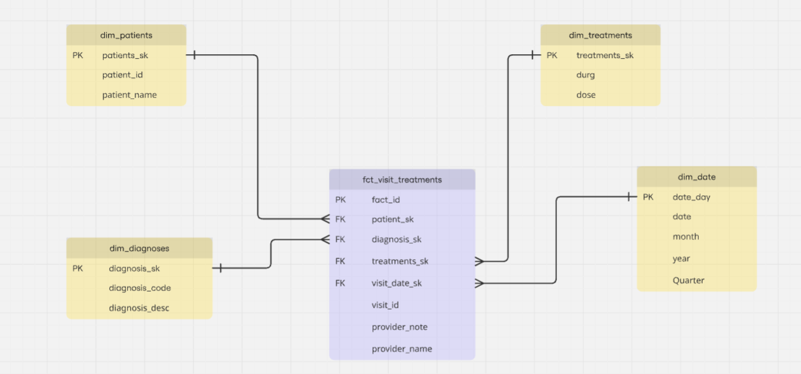

# Healthcare Data Model Documentation

This README outlines key **data and modeling assumptions** for a healthcare dataset designed using a **star schema** approach. The model supports analytical use cases related to patient visits, diagnoses, and treatments, with an emphasis on flexibility, scalability, and regulatory compliance (e.g., HIPAA/GDPR).

---
## Data Model

---

## 📊 Data Assumptions

- Each **patient** can have **one or more visits**.
- Each **visit** can include **multiple diagnoses and treatments**.
- Each **treatment** is linked to a **specific diagnosis within a visit**.
- Diagnoses and treatments have a **many-to-many** relationship:
  - A diagnosis can result in multiple treatments.
  - A treatment can address multiple diagnoses.
- `visit_date` is the **primary date** used for:
  - Partitioning
  - Filtering
  - Time-series analysis

---

## 🏗️ Data Modeling Assumptions

We are using a **star schema** composed of:

### 🧮 Fact Table
- `fact_visit_treatments`: Records the intersection of visits, diagnoses, and treatments.

### 📐 Dimension Tables
- `dim_patients`
- `dim_diagnoses`
- `dim_treatments`
- `dim_date`

### ⚙️ Modeling 

- **Treatments and diagnoses are modeled separately** for the following reasons:
  - They represent **distinct concepts**.
  - Keeping them separate allows for **analysis of treatments independent of diagnoses**.
  - Combining into a single `dim_treatment_diagnoses` would result in **redundant records**.

- **Fact tables use surrogate keys** to support:
  - Tracking changes
  - Joining with dimensions efficiently

- **Visit-related attributes** are stored in the fact table for now. However, a separate `dim_visit` could be introduced if:
  - Additional metadata (e.g., location, department) is added.
  - Multiple fact tables reference visit-level information.
  - Visit-level deduplication is required.
  - Reports specific to **visits** are needed.

---

## ⚖️ Trade-offs & Considerations

| Design Choice | Pros | Cons |
|---------------|------|------|
| Separate `dim_treatments` and `dim_diagnoses` | Clean, reusable, deduplicated data | Requires joins for joint analysis |
| Keeping visit info in fact table | Simple design, immediate availability | May require schema changes if visit metadata grows |
| Potential `dim_visit` creation | Enables reuse, normalization, better reporting | Adds complexity |
| No incremental model in dbt | Simple design for very small workload | As the size increases, should think of adding support incremental models |

> **Note:** If combining diagnoses and treatments into one dimension, you simplify the schema and can analyze "how diagnoses are treated" more directly—but at the cost of **redundancy** and **loss of flexibility**.

### Talk ABout
- Performance Management - Indexing and partitioning
- Handling Data Security

